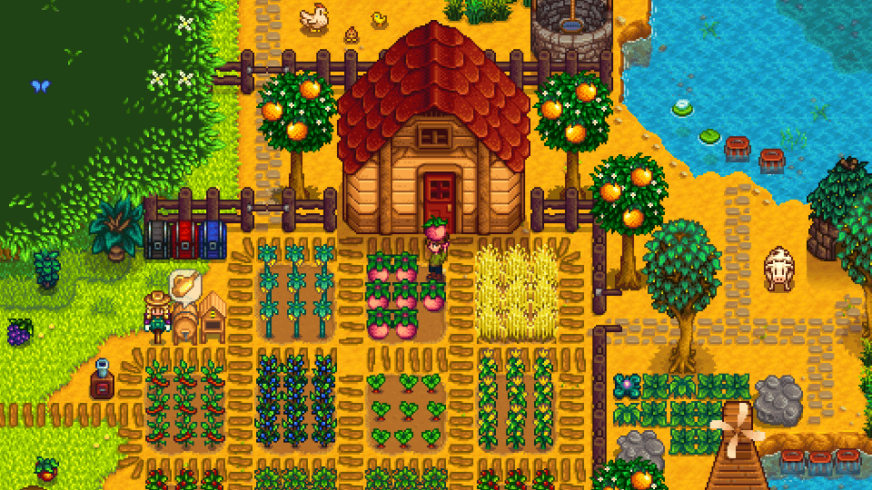
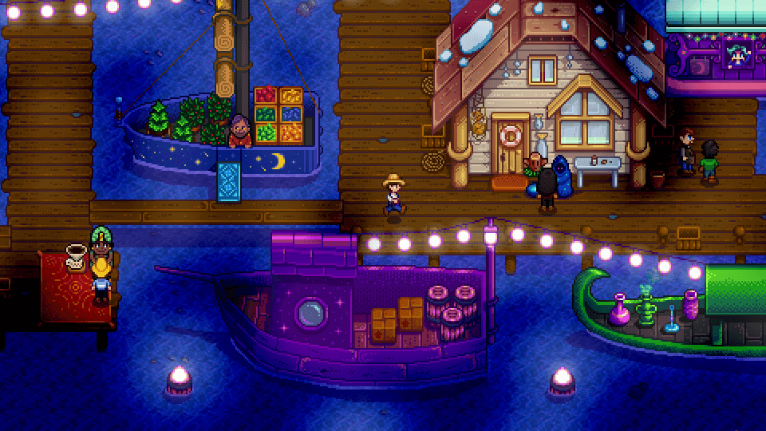
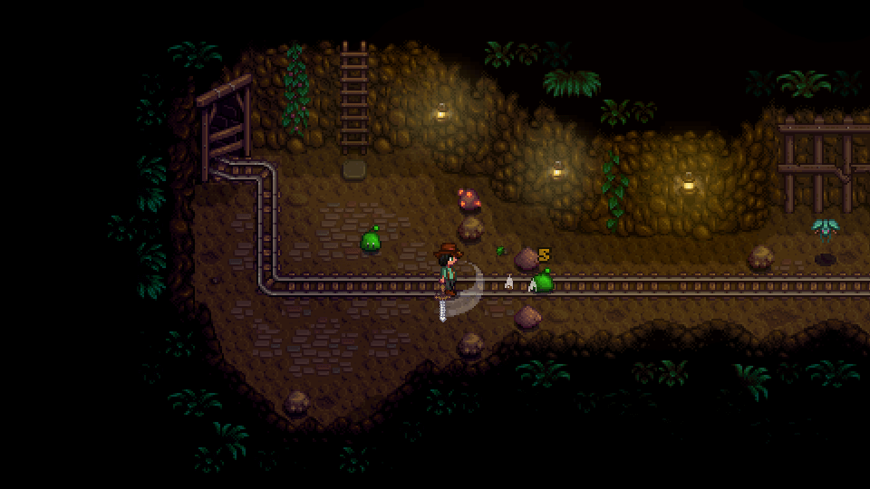
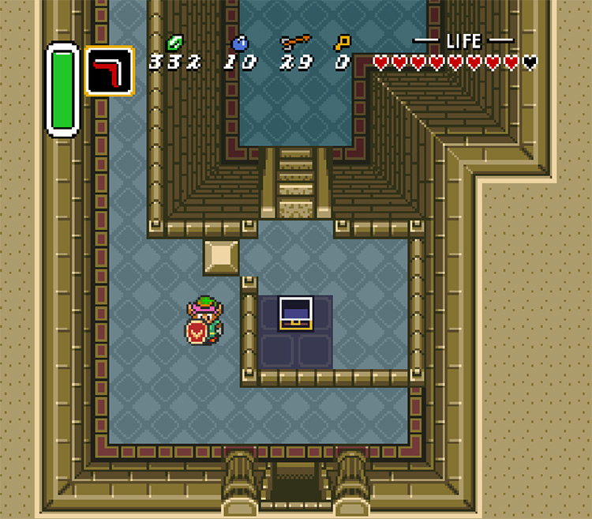
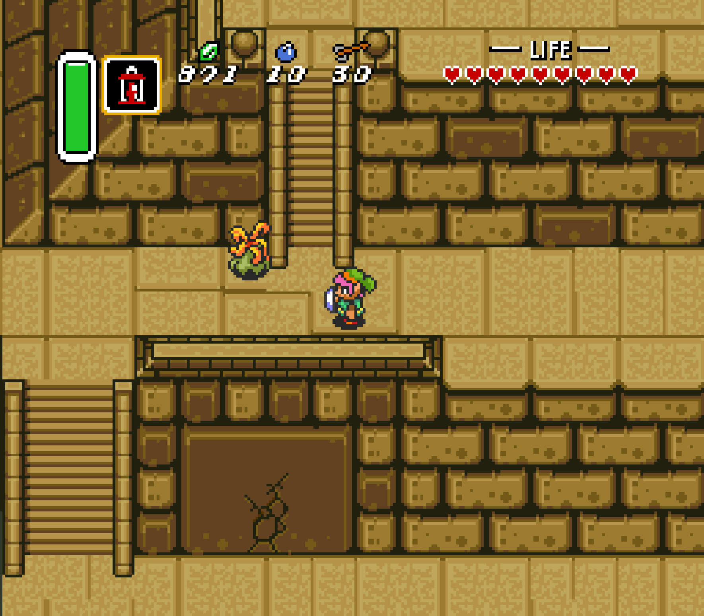
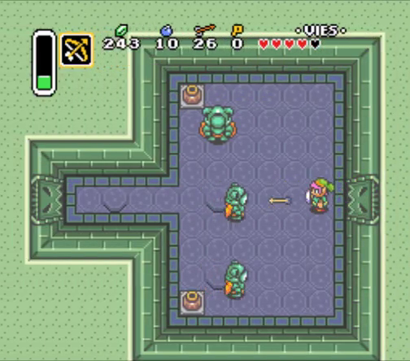

# Project Psyche — Visual Reference Guide

This folder is a **reference pack for the Project Psyche vertical slice**. These images are visual/design references only. They are not production assets and must never be loaded into the shipped game.

The goal is not to make a clone of *Stardew Valley* or *The Legend of Zelda: A Link to the Past*. The goal is to learn from specific strengths in each game and translate those strengths into an original Project Psyche visual language.

## Reference-use rules

1. **Do not copy, trace, extract, recolor, or ship any reference image or sprite.**
2. Use the references to judge composition, scale, density, hierarchy, pacing, readability, and atmosphere.
3. Every production sprite, tile, map, UI element, sound, and character must be original.
4. When a critic says “make this more Stardew-like” or “more Zelda-like,” it must state the exact property it means: density, path width, room framing, readability, contrast, etc.
5. References should be compared side-by-side with current Project Psyche screenshots during visual QA.

---

# Design North Star

Project Psyche should combine:

- **Stardew Valley:** warmth, lived-in world density, environmental texture, cozy character scale, festival atmosphere, environmental animation, and a town that feels inhabited.
- **A Link to the Past:** room readability, strong spatial composition, compact traversal, clear collision boundaries, dungeon visual language, environmental puzzle readability, combat clarity, and immediate top-down action-game readability.

It should **not** copy:

- Stardew’s exact tile palette, buildings, sprites, UI, farming layout, or character proportions.
- Zelda’s exact dungeon tiles, HUD, enemies, room layouts, palette, iconography, or character designs.

---

# STardew Valley References

## 1. World Density + Cozy Environmental Layering

**File:** `references/stardew/stardew_farm_world_density.png`

**Use this reference for:**

- compact world composition
- dense but readable decoration
- paths weaving naturally around functional areas
- vegetation filling negative space
- strong separation between walkable paths and decorative terrain
- environmental layering around buildings
- readable entrances
- warm, inviting palette relationships
- making small spaces feel rich rather than cramped

**Specific lesson for Lumen Vale:**

Lumen Vale should not have large empty grass fields surrounding isolated buildings. Important spaces should be visually connected through paths, fences, shrubs, gardens, water, props, and small landmarks.

**Do not copy:**

- farm crop layout
- farmhouse design
- exact trees, crops, fences, or tile textures
- exact color palette

**Critic questions:**

- Does every screen have enough environmental information to feel intentionally authored?
- Are there large dead areas with no gameplay or visual purpose?
- Are buildings integrated into their surroundings rather than dropped onto empty terrain?
- Can the player immediately read where they can walk?

**Source:** Official Stardew Valley website screenshot.

---

## 2. Festival / Special-Event Transformation

**File:** `references/stardew/stardew_night_market_festival.png`

**Use this reference for:**

- making a familiar location feel transformed during an event
- high prop density without losing navigation readability
- lighting as a major mood shift
- clusters of NPC activity
- decorative strings of lights
- visual focal points
- small stalls and attractions creating implied activity
- color accents that distinguish a festival from ordinary town life

**Specific lesson for Festival Plaza:**

When the Festival of Lanterns begins, the player should feel that Lumen Vale has changed. The plaza should not simply add three NPCs and a banner. Lighting, decorations, crowd placement, sound, animated lanterns, stalls, and movement should create a clear event-state transformation.

**Do not copy:**

- Night Market boats
- exact lighting colors
- stall designs
- decorations
- layout

**Critic questions:**

- If the HUD were hidden, would the screenshot immediately read as a special event?
- Is there a clear visual center of attention?
- Does the crowd feel like a gathering rather than NPCs standing randomly?
- Is the playable route still easy to understand despite increased density?

**Source:** Official Stardew Valley website screenshot.

---

## 3. Dark-Area Atmosphere + Readable Exploration

**File:** `references/stardew/stardew_mine_atmosphere.png`

**Use this reference for:**

- darkness surrounding a readable play space
- localized light sources
- simple terrain with strong atmosphere
- environmental framing
- small enemies standing out from terrain
- communicating danger without overwhelming visual complexity

**Specific lesson for Echo Shrine / Whisper Woods:**

Darker environments should not simply reduce brightness globally. Use controlled pockets of light and contrast to keep interactables, enemies, paths, and puzzle elements readable.

**Do not copy:**

- mine rails
- slimes
- cave tiles
- exact lighting solution

**Critic questions:**

- Are important puzzle objects readable at a glance?
- Does darkness create atmosphere without hiding gameplay information?
- Do enemies separate clearly from the background?
- Are light sources doing compositional work?

**Source:** Official Stardew Valley website screenshot.

---

# A Link to the Past References

## 4. Dungeon Room Composition

**File:** `references/zelda/alttp_dungeon_room_composition.jpg`

**Use this reference for:**

- framing an entire gameplay problem within one readable room
- strong wall boundaries
- obvious entrances and exits
- clear spatial hierarchy
- placing a focal interactable within a room
- compact room size
- using architecture to guide attention

**Specific lesson for Echo Shrine:**

Each major puzzle room should have an immediately understandable spatial structure. The player should be able to enter, pause for one second, and understand the important components of the room before understanding the solution.

**Do not copy:**

- dungeon wall tiles
- chest design
- HUD
- room geometry
- Link sprite

**Critic questions:**

- Is the room’s purpose visually legible on entry?
- Can the player identify exits, hazards, and major interactables quickly?
- Is the puzzle spatially contained enough to reason about?
- Is there unnecessary empty floor space?

**Source:** Screenshot of A Link to the Past reproduced by FandomSpot.

---

## 5. Navigation, Elevation Cues + Environmental Secrets

**File:** `references/zelda/alttp_dungeon_navigation.png`

**Use this reference for:**

- strong navigational geometry
- clear ledges and collision boundaries
- readable stairs/ladders
- environmental clues such as damaged walls
- multiple possible routes visible within a compact space
- creating curiosity through visible but not immediately accessible areas

**Specific lesson for Echo Shrine:**

Dungeon rooms should communicate traversal rules visually. Doors, ledges, gates, pressure plates, cracked surfaces, and barriers should look mechanically meaningful before the player interacts with them.

**Do not copy:**

- wall artwork
- cracked-wall sprite
- exact elevation treatment
- enemies
- UI

**Critic questions:**

- Are collision boundaries visually obvious?
- Can the player distinguish traversable floor from raised/blocked geometry?
- Do secret or interactive surfaces look subtly suspicious rather than arbitrary?
- Can players form hypotheses about the environment from visuals alone?

**Source:** Zelda Universe A Link to the Past walkthrough screenshot.

---

## 6. Combat Readability in a Puzzle Room

**File:** `references/zelda/alttp_combat_room.png`

**Use this reference for:**

- clean enemy silhouettes
- enough open floor space for movement
- clear separation between arena boundary and play space
- combat encounters that still feel like authored rooms
- enemy placement that creates immediate tactical information
- compact encounter composition

**Specific lesson for Project Psyche combat:**

Combat rooms should not become huge empty arenas. Enemy encounters should be deliberately framed and should coexist with the game’s environmental puzzle language.

**Do not copy:**

- Armos enemies
- dungeon palette
- room layout
- player sprite
- HUD

**Critic questions:**

- Can the player parse all enemies immediately?
- Is there enough room to dodge without making the room feel empty?
- Does enemy placement produce an intentional encounter rather than random spawning?
- Is the environment still visually relevant during combat?

**Source:** A Link to the Past Eastern Palace screenshot reproduced by SuperSoluce.

---

# How These References Map to Project Psyche

## Lumen Vale / Town Square

Primary references:

- `stardew_farm_world_density.png`

Target qualities:

- warm
- compact
- dense
- charming
- easily navigable
- visually full without clutter
- recurring landmarks visible from multiple routes

Avoid:

- huge empty grass fields
- evenly spaced buildings
- long featureless roads
- repetitive procedural decoration

---

## Lantern Inn

Primary qualities to derive from Stardew generally:

- small but highly decorated interior
- strong visual identity
- obvious functional zones
- environmental storytelling
- warm lighting
- props associated with Mira and Pip

The inn should feel like a place where someone lives and works, not a rectangular quest room.

---

## Festival Plaza

Primary reference:

- `stardew_night_market_festival.png`

Target qualities:

- transformed state
- crowd energy
- decorative lighting
- clusters of activity
- a strong centerpiece
- clear festival route and trial area

The conformity quest depends on the player feeling surrounded by a social group. Visual crowd composition is therefore part of the gameplay mechanic, not just decoration.

---

## Whisper Woods

Primary references:

- `stardew_mine_atmosphere.png`
- Zelda navigation principles

Target qualities:

- fast readability
- moody transition away from town
- modest combat
- environmental secrets
- clear pathing with small deviations

This is a pacing zone, not a giant forest level.

---

## Echo Shrine

Primary references:

- `alttp_dungeon_room_composition.jpg`
- `alttp_dungeon_navigation.png`
- `alttp_combat_room.png`
- `stardew_mine_atmosphere.png` for atmospheric lighting only

Target qualities:

- compact authored rooms
- immediate spatial readability
- clear puzzle components
- strong entrances/exits
- readable enemies
- memorable room silhouettes
- darkness used selectively
- original Project Psyche rune / Echo visual language

The shrine should feel closer to a designed Zelda dungeon than a random cave.

---

# Camera + Scale Guidance

Use the references comparatively rather than copying their exact numeric scale.

We want:

- a character large enough to show personality and reactions
- enough surrounding world visible to reason about puzzles and navigation
- buildings that read immediately as meaningful landmarks
- dungeon rooms that often fit most or all of the important puzzle state on screen

Avoid zooming so far in that world navigation becomes claustrophobic.

Avoid zooming so far out that characters become anonymous dots.

The visual critic should evaluate character-to-building and character-to-room scale repeatedly from actual screenshots.

---

# Environmental Density Rule

For each screenshot of the current game, identify three layers:

1. **Gameplay layer** — paths, doors, enemies, puzzle objects, NPCs.
2. **Structural layer** — buildings, walls, water, trees, cliffs, fences.
3. **Texture layer** — flowers, grass variation, props, signs, lights, shadows, particles.

If a scene has only the gameplay and structural layers, it will likely look like a prototype.

If the texture layer overwhelms gameplay readability, reduce it.

The goal is intentional density.

---

# Screenshot Review Template

For every major visual gauntlet pass, capture current Project Psyche screenshots and compare them to the most relevant reference above.

A visual critic should answer:

### Composition
- Where does the eye go first?
- Is that where we want it to go?
- Are important landmarks visually distinct?

### Density
- Are there dead areas?
- Does decoration feel intentional?
- Is the screen too busy?

### Readability
- Is the player immediately visible?
- Are NPCs distinct from props?
- Are interactables readable?
- Are walkable boundaries obvious?

### Scale
- Do buildings, paths, characters, and props feel proportionally coherent?
- Are paths much wider than necessary?
- Does the world feel miniature in a good way rather than empty?

### Atmosphere
- Does the area have a specific mood?
- Are lighting and environmental motion helping?

### Originality
- Does this look like Project Psyche?
- Or does it look like someone attempted to reproduce Stardew/Zelda assets?

### Commercial-quality check

Ask:

> If this screenshot appeared on a Steam store page beside polished indie pixel-art games, would it look intentional and finished?

If the answer is no, identify exactly why and fix it.

---

# Reference Priority by Feature

| Project Psyche feature | Primary reference lesson |
|---|---|
| Lumen Vale | Stardew world density and warmth |
| Town paths | Stardew organic path integration |
| Buildings | Stardew environmental integration, but original architecture |
| Festival Plaza | Stardew Night Market event transformation |
| Whisper Woods | Atmospheric readability + Zelda navigation |
| Echo Shrine | A Link to the Past room composition |
| Puzzle rooms | A Link to the Past spatial readability |
| Combat rooms | A Link to the Past compact encounter composition |
| Dark environments | Stardew mine lighting restraint |
| NPC presence | Stardew lived-in community feeling |
| Overall game | Original Project Psyche identity |

---

# Final Reminder to Agents

These references are **constraints on quality, not templates to reproduce**.

Extract principles.

Do not extract assets.

The desired result is not:

> “This looks exactly like Stardew Valley or Zelda.”

It is:

> “This feels as deliberate, readable, warm, and polished as the games that inspired it — but it clearly belongs to its own world.”
